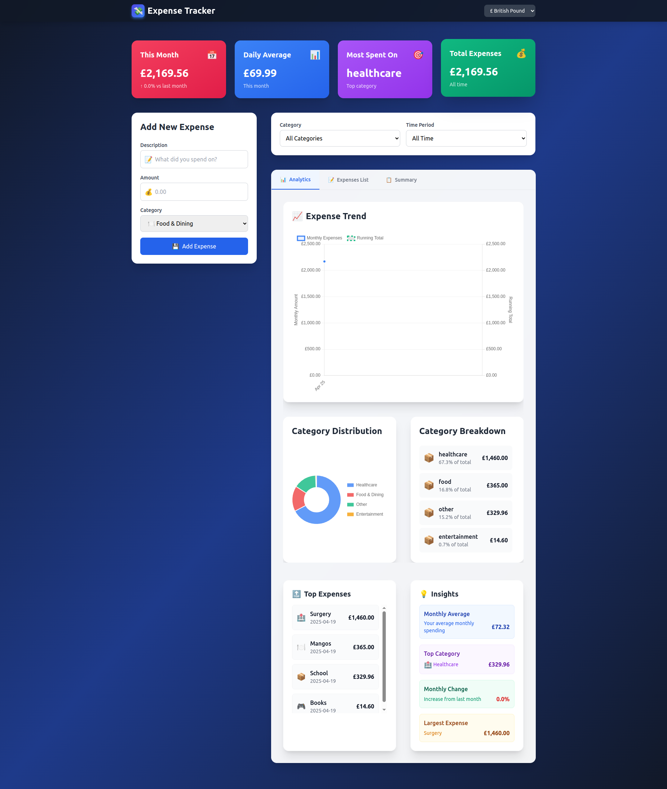
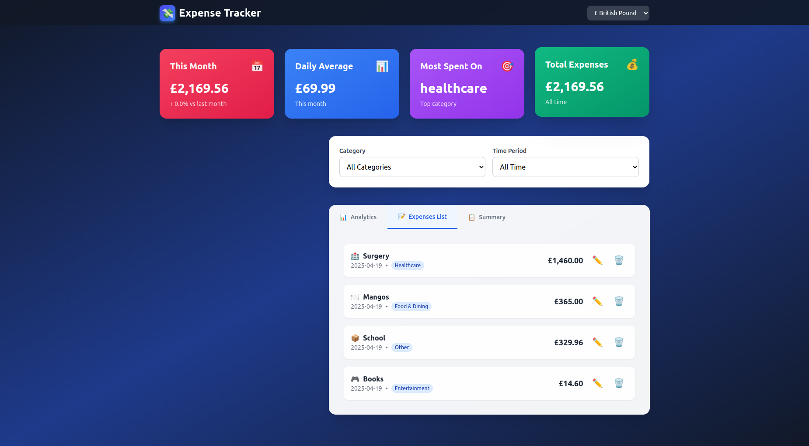
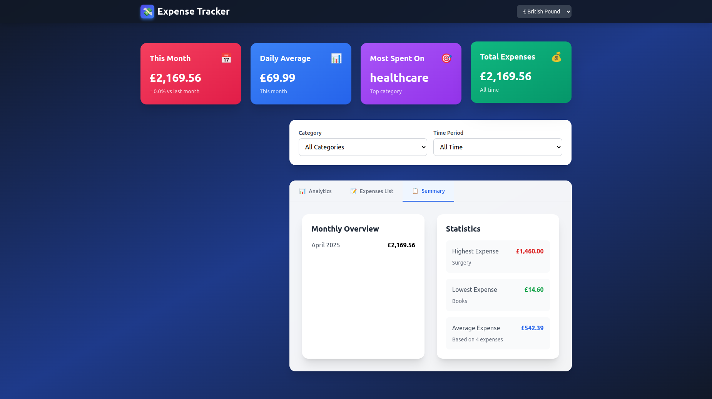
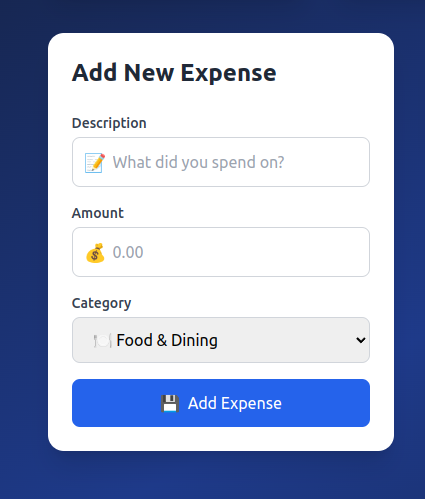
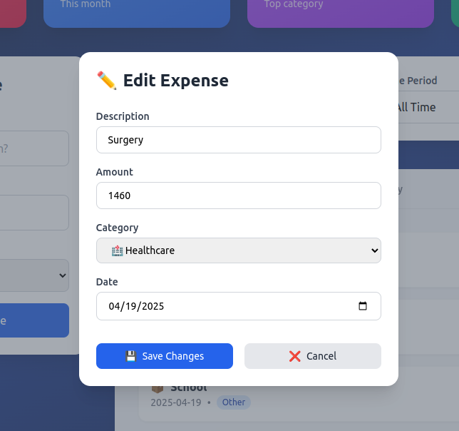

# 💸 Expense Tracker

A modern, responsive, and feature-rich expense tracking application built with **React**, **Chart.js**, and **Tailwind CSS**. Track your daily expenses, analyze spending habits with interactive charts, and convert currencies in real-time.


---

## ✨ Features

### 📊 **Data Visualization**
- **Interactive Charts**: Track expenses over time with beautiful line charts showing monthly trends and running totals
- **Category Analysis**: Visualize spending distribution with doughnut charts
- **Real-time Updates**: Charts automatically update as you add or modify expenses

### 🌍 **Multi-Currency Support**
- **Real-time Conversion**: Instantly switch between popular currencies (USD, EUR, GBP, JPY, INR)
- **Live Exchange Rates**: Powered by [exchangerate.host](https://exchangerate.host) API
- **Automatic Conversion**: All existing expenses are automatically converted when you change currency

### 💾 **Data Persistence**
- **LocalStorage Integration**: All expenses and settings are automatically saved to your browser
- **No Account Required**: Works completely offline after initial load
- **Data Privacy**: All data stays on your device

### 🧾 **Expense Management**
- **Add Expenses**: Quick and easy expense entry with description, amount, category, and date
- **Edit Expenses**: Update any expense with a simple click
- **Delete Expenses**: Remove expenses you no longer need
- **Category System**: Organize expenses into 7 predefined categories:
  - 🍽️ Food & Dining
  - 🚗 Transportation
  - 🛍️ Shopping
  - 📱 Bills & Utilities
  - 🎮 Entertainment
  - 🏥 Healthcare
  - 📦 Other

### 📈 **Analytics & Insights**
- **Monthly Overview**: See your spending patterns month by month
- **Top Expenses**: View your highest expenses at a glance
- **Category Breakdown**: Understand where your money goes
- **Statistics Dashboard**: Track highest, lowest, and average expenses
- **Monthly Comparisons**: Compare current month with previous month

### 🔍 **Filtering & Search**
- **Category Filters**: Filter expenses by specific categories
- **Time Period Filters**: View expenses by week, month, year, or all time
- **Combined Filters**: Use multiple filters simultaneously

### 📱 **Responsive Design**
- **Mobile-First**: Optimized for all screen sizes
- **Touch-Friendly**: Large buttons and intuitive gestures
- **Desktop Optimized**: Enhanced layout for larger screens

---

## 🚀 Tech Stack

### Frontend
- **React 18.2.0** - Modern UI library
- **Tailwind CSS 3.3.0** - Utility-first CSS framework
- **Chart.js 4.4.9** - Powerful charting library
- **react-chartjs-2 5.3.0** - React wrapper for Chart.js

### APIs & Services
- **exchangerate.host** - Real-time currency exchange rates

### Development Tools
- **React Scripts 5.0.1** - Build tooling
- **PostCSS** - CSS processing
- **Autoprefixer** - CSS vendor prefixing

---

## 📦 Installation

### Prerequisites
- Node.js (v14 or higher)
- npm or yarn package manager

### Setup Instructions

1. **Clone the repository**:
   ```bash
   git clone https://github.com/Samuel-Hailemariam-Seifu/expense-tracker.git
   cd expense-tracker
   ```

2. **Install dependencies**:
   ```bash
   npm install
   ```

3. **Start the development server**:
   ```bash
   npm start
   ```

4. **Open your browser**:
   The app will automatically open at `http://localhost:3000`

### Build for Production

To create an optimized production build:

```bash
npm run build
```

The build folder will contain the production-ready files.

---

## 🛠 Project Structure

```
expense-tracker/
│
├── public/
│   └── index.html          # HTML template
│
├── src/
│   ├── components/
│   │   ├── CurrencySelector.js    # Currency selection component
│   │   ├── EditExpenseModal.js    # Modal for editing expenses
│   │   ├── ExpenseCharts.js       # Chart components (Line & Doughnut)
│   │   ├── Logo.js                # Application logo
│   │   └── TabView.js             # Tab navigation component
│   │
│   ├── hooks/
│   │   └── useCurrencyConverter.js  # Currency conversion hook
│   │
│   ├── assets/
│   │   └── screenshots/          # Application screenshots
│   │
│   ├── App.js                    # Main application component
│   ├── App.css                   # Application styles
│   ├── index.js                  # Application entry point
│   └── index.css                 # Global styles
│
├── package.json                  # Project dependencies
├── tailwind.config.js            # Tailwind CSS configuration
├── postcss.config.js             # PostCSS configuration
└── README.md                      # Project documentation
```

---

## 📖 Usage Guide

### Adding an Expense

1. Fill in the expense form on the left side of the screen
2. Enter a description (e.g., "Groceries")
3. Enter the amount spent
4. Select a category from the dropdown
5. Click "Add Expense" button

### Viewing Analytics

1. Navigate to the **Analytics** tab
2. View your expense trends in the line chart
3. Check category distribution in the doughnut chart
4. Review top expenses and insights

### Filtering Expenses

1. Use the **Category** filter to show expenses from specific categories
2. Use the **Time Period** filter to view expenses from different time ranges
3. Filters can be combined for more specific views

### Changing Currency

1. Click on the currency selector in the top navigation bar
2. Select your desired currency
3. All expenses will be automatically converted using real-time exchange rates

### Editing an Expense

1. Click the ✏️ edit button on any expense item
2. Modify the details in the modal
3. Click "Save Changes" to update

### Deleting an Expense

1. Click the 🗑️ delete button on any expense item
2. The expense will be immediately removed

---

## 📷 Screenshots

### Dashboard Overview


### Expense List View


### Summary Statistics


### Add Expense Form


### Edit Expense Modal


---

## 🎨 Design Features

- **Modern UI**: Clean, professional interface with smooth animations
- **Glass Morphism**: Subtle backdrop blur effects for a modern look
- **Gradient Accents**: Beautiful color gradients throughout the interface
- **Responsive Cards**: Elegant card-based layout with hover effects
- **Intuitive Navigation**: Easy-to-use tab system for different views
- **Color-Coded Categories**: Visual category indicators for quick recognition

---

## 🔧 Configuration

### Customizing Categories

Edit the `EXPENSE_CATEGORIES` array in `src/App.js`:

```javascript
const EXPENSE_CATEGORIES = [
  { id: 'food', name: 'Food & Dining', icon: '🍽️' },
  // Add your custom categories here
];
```

### Adding New Currencies

Edit the `CURRENCIES` array in `src/App.js`:

```javascript
const CURRENCIES = [
  { code: 'USD', symbol: '$', name: 'US Dollar' },
  // Add your custom currencies here
];
```

### Styling Customization

Modify `tailwind.config.js` to customize colors, fonts, and other design tokens:

```javascript
module.exports = {
  theme: {
    extend: {
      colors: {
        // Add your custom colors
      },
    },
  },
}
```

---

## 🧪 Testing

Run the test suite:

```bash
npm test
```

---

## 🚢 Deployment

### Deploy to Vercel

1. Push your code to GitHub
2. Import your repository on [Vercel](https://vercel.com)
3. Vercel will automatically detect React and deploy

### Deploy to Netlify

1. Build your project: `npm run build`
2. Drag and drop the `build` folder to [Netlify](https://netlify.com)
3. Or connect your GitHub repository for automatic deployments

### Deploy to GitHub Pages

1. Install gh-pages: `npm install --save-dev gh-pages`
2. Add to `package.json`:
   ```json
   "homepage": "https://yourusername.github.io/expense-tracker",
   "scripts": {
     "predeploy": "npm run build",
     "deploy": "gh-pages -d build"
   }
   ```
3. Deploy: `npm run deploy`

---

## 🤝 Contributing

Contributions are welcome! Please feel free to submit a Pull Request. For major changes:

1. Fork the repository
2. Create your feature branch (`git checkout -b feature/AmazingFeature`)
3. Commit your changes (`git commit -m 'Add some AmazingFeature'`)
4. Push to the branch (`git push origin feature/AmazingFeature`)
5. Open a Pull Request

### Contribution Guidelines

- Follow the existing code style
- Add comments for complex logic
- Update documentation as needed
- Test your changes thoroughly

---

## 📝 License

This project is open source and available under the [MIT License](LICENSE).

---

## 👤 Author

**Samuel Hailemariam Seifu**

- GitHub: [@Samuel-Hailemariam-Seifu](https://github.com/Samuel-Hailemariam-Seifu)
- Project Link: [https://github.com/Samuel-Hailemariam-Seifu/expense-tracker](https://github.com/Samuel-Hailemariam-Seifu/expense-tracker)

---

## 🙏 Acknowledgments

- [Chart.js](https://www.chartjs.org/) for the amazing charting library
- [Tailwind CSS](https://tailwindcss.com/) for the utility-first CSS framework
- [exchangerate.host](https://exchangerate.host) for providing free currency exchange rates
- React community for excellent documentation and resources

---

## 📞 Support

If you have any questions or need help, please:
- Open an issue on GitHub
- Check existing issues for solutions
- Review the documentation above

---

**Made with ❤️ using React and Tailwind CSS**
